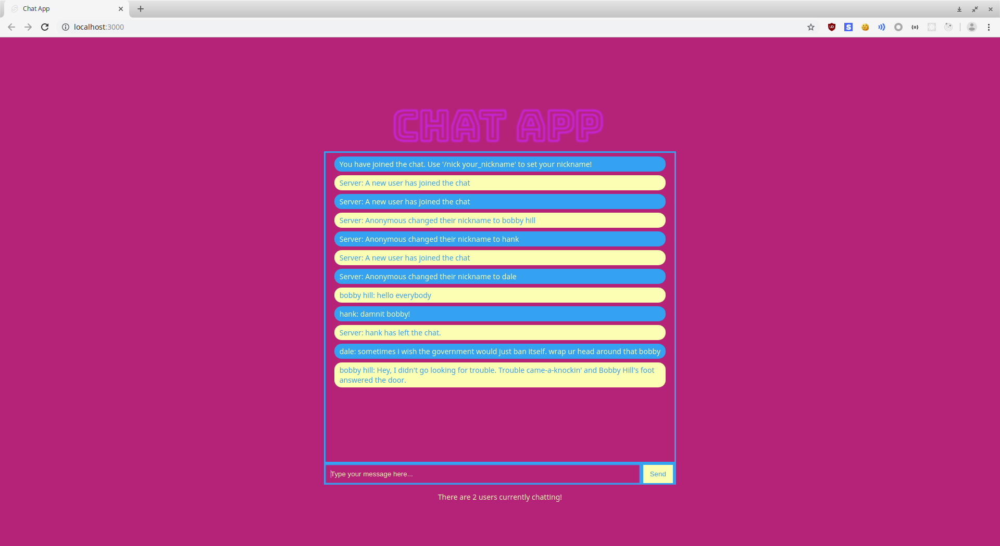

# Chat App



A simple chat app I created to help myself learn Svelte / Sapper and Socket.IO. It can be used as a fun example app to build with a group of students when teaching these technologies (along with Polka, Rollup, and even Cypress). You can play with the demo [here](https://chat-app-svelte.herokuapp.com). Note however, I use a free tier at Heroku so the initial start up time is pretty slow!

The chat app implements the following functionality:
* Joining the chat
* Setting a nickname
* Sending group messages
* Leaving the chat
* Server messages when appropriate (a user setting a nickname, joining / leaving the chat, etc.)
* Providing the user with the number of current other online users

## Build
To build, `cd` to project root and run:
```
$ npm install && npm run build
```

## Run
To run the app in development, it is suggested you use the following command from the project root:
```
$ npm run dev
```

## License
The source of this app may be used under the WTFPL - or, if you take issue with that, consider it to be under the CC0.

## Contributing
Feedback and contributions are welcome. Feel free to create issues, fork, submit pull requests, etc.

Finally, if you want to contribute in a different way, you can always buy me a coffee ^_^

[](https://www.buymeacoffee.com/tmns)
